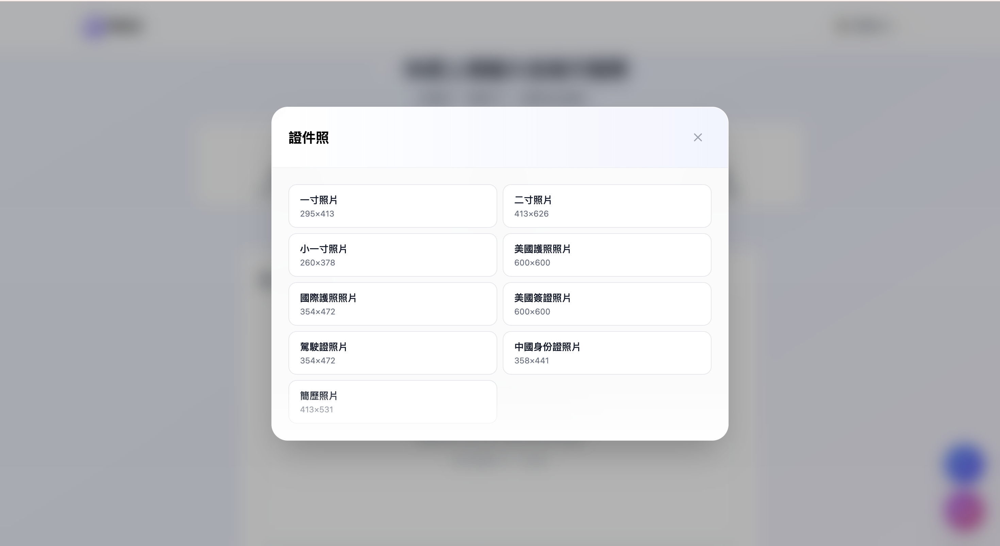

# PixID - 智能圖片裁剪工具

<div align="center">


**快速裁剪社交媒體頭像和證件照**

[🌐 線上演示](https://weiawesome.github.io/PixID/) | [📖 English](README.md) | [📖 中文](README.zh.md)

[](https://github.com/weiawesome/PixID)

</div>

## ✨ 功能特色

### 🚀 快速上傳
- **拖放上傳**：直接拖放圖片即可上傳
- **點擊上傳**：支援傳統檔案選擇器
- **多種格式**：支援 JPEG、PNG、WebP 和 HEIC 格式
- **HEIC 支援**：自動將 HEIC/HEIF 轉換為 JPEG

### ✂️ 智能裁剪
- **預設尺寸**：多種社交媒體和證件照預設尺寸
- **自訂比例**：可調整長寬比進行靈活裁剪
- **縮放控制**：使用滑鼠滾輪進行精確縮放
- **旋轉功能**：向左或向右旋轉 90°
- **即時預覽**：即時查看變更效果

### 📥 一鍵導出
- **高品質**：以高品質設定導出圖片
- **多種格式**：支援導出為 JPEG、PNG 或 WebP
- **快速下載**：裁剪後立即下載

## 🎯 預設尺寸

### 社交媒體頭像
- **Twitter/X**：400×400 像素
- **Facebook**：720×720 像素
- **Instagram**：320×320 像素
- **LinkedIn**：400×400 像素
- **YouTube**：800×800 像素
- **TikTok**：200×200 像素
- **Discord**：128×128 像素

### 證件照
- **一寸照片**：25×35mm (295×413px @ 300 DPI)
- **二寸照片**：35×53mm (413×626px @ 300 DPI)
- **小一寸照片**：22×32mm (260×378px @ 300 DPI)
- **美國護照照片**：2×2 英吋 (600×600px @ 300 DPI)
- **國際護照照片**：35×45mm (354×472px @ 300 DPI)
- **美國簽證照片**：2×2 英吋 (600×600px @ 300 DPI)
- **駕駛證照片**：35×45mm (354×472px @ 300 DPI)
- **中國身份證照片**：26×32mm (358×441px @ 350 DPI)
- **簡歷照片**：35×45mm (413×531px @ 300 DPI)

## 🌍 多語言支援

PixID 支援 5 種語言：
- 繁體中文
- 简体中文
- English
- 日本語
- 한국어

## 📸 功能截圖

### 預覽


### 尺寸選擇


### 調整與導出


## 🚀 開始使用

### 環境需求
- Node.js 20 或更高版本
- npm 或 yarn

### 安裝步驟

```bash
# 複製專案
git clone https://github.com/weiawesome/PixID.git

# 進入專案目錄
cd PixID

# 安裝依賴
npm install

# 啟動開發伺服器
npm run dev
```

### 建置生產版本

```bash
# 建置專案
npm run build

# 預覽生產版本
npm run preview
```

## 📦 技術棧

- **React 19** - UI 框架
- **TypeScript** - 型別安全
- **Vite** - 建置工具
- **Tailwind CSS** - 樣式框架
- **i18next** - 國際化
- **react-easy-crop** - 圖片裁剪
- **heic2any** - HEIC 格式轉換

## 🎨 功能詳情

### 圖片上傳
- 最大檔案大小：10MB
- 支援格式：JPEG、PNG、WebP、HEIC/HEIF
- 自動 HEIC 轉 JPEG 轉換
- 支援多檔案選擇

### 圖片裁剪
- 互動式裁剪區域，支援拖拽
- 使用滑鼠滾輪縮放
- 向左或向右旋轉 90°
- 重置為預設設定
- 即時預覽

## 📄 授權

本專案為開源專案，採用 [MIT License](LICENSE) 授權。

## 👤 作者

由 [tcweeei](https://github.com/tcweeei) 創建

## 🤝 貢獻

歡迎提交問題、功能請求或貢獻代碼！歡迎查看 [問題頁面](https://github.com/weiawesome/PixID/issues)。